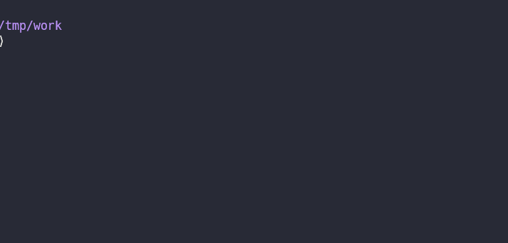
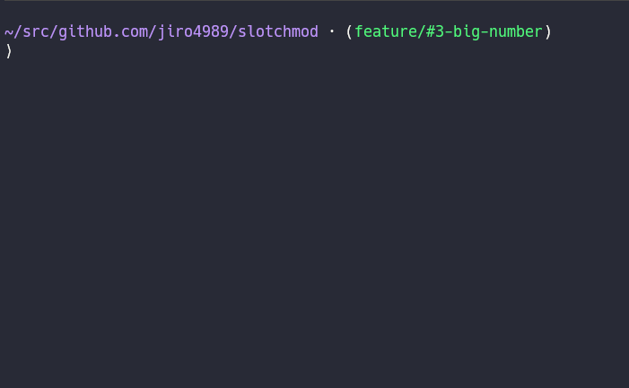

= slotchmod
:sectnums:
:toc: left

`slotchmod` changes file permission with a slot.
This is a useful tool when you want to mess up file access permissions.

== Usage

[source,bash]
----
slotchmod [files...]
----

== Installation

=== With Go

[source,bash]
----
go install github.com/jiro4989/slotchmod@master
----

=== With Nix

[source,bash]
----
nix profile add github:jiro4989/slotchmod
----

=== Manual

Download executables from https://github.com/jiro4989/slotchmod/releases[GitHub Releases].

== Key input

[options="header"]
|=================
| Key | Description
| Enter | Select slot
| q, Ctrl-C, Ctrl-D | Quit
|=================

== Help

[source,text]
----
slotchmod changes file permissions with a slot

Usage:
  slotchmod [OPTIONS] [files...]

Examples:
  slotchmod sample.txt

Options:
  -level string
    slot difficulty. [easy|normal|hard] (default "normal")
----
